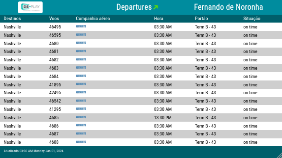
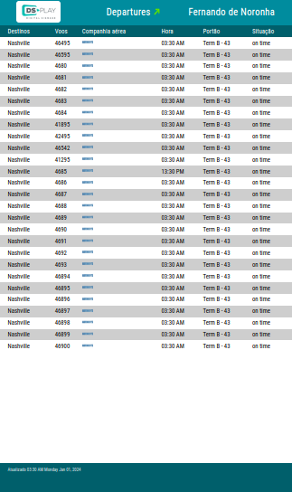
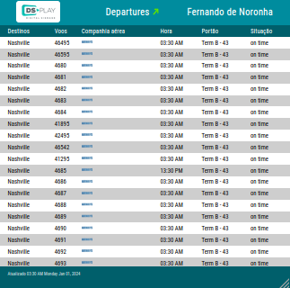

# DSPLAY - Flight information
- Template to display a flight information.

## Supported Screen Formats/Resolutions

- Landscape

  
- Portrait

  
- Square

  

### Configuration

This template has some configuration variables as the following table shows:

| Variable              | Type    | Default    | Description                                        |
|-----------------------|---------|------------| ---------------------------------------------------|
| `themeChoice`            | text   | none       | themes, values ["theme_1", "theme_2", "theme_3", "theme_4"] (Default "theme_1")                                   |
| `flightList`          | list   | [{},{}]    | flight list    |

Flight List [...]
|Attributes             | Type    | Example    | Description                                        |
|-----------------------|---------|------------| ---------------------------------------------------|
| `destination`          | text   | 'Nashville'    | destinations.                                |
| `flight`          | text   | '0000'    | flight number    |
| `airline`          | text   | 'https://www.urlExample.com'    | image link    |
| `departureTime`          | text   | '2023-06-05T10:16'    | datetime, iso format    |
| `gate`          | text   | 'Term B - 52'    | gate description    |
| `status`          | text   | 'on time'    | flight status    |


## Getting started
```
  git clone https://github.com/dsplay/template-countdown.git my-awesome-template
  cd my-awesome-template
  rm -rf .git
  npm install
  npm start
```

## Packing (release build)
  To create a release build of the template, ready to be uploaded to DSPLAY, just run:
  ```
    npm run zip
  ```
  It will generate a template.zip file ready to be deployed to [DSPLAY Web Manager](https://manager.dsplay.tv/template/create)

## More

The see more about DSPLAY HTML Templates, visit: https://developers.dsplay.tv/docs/html-templates
